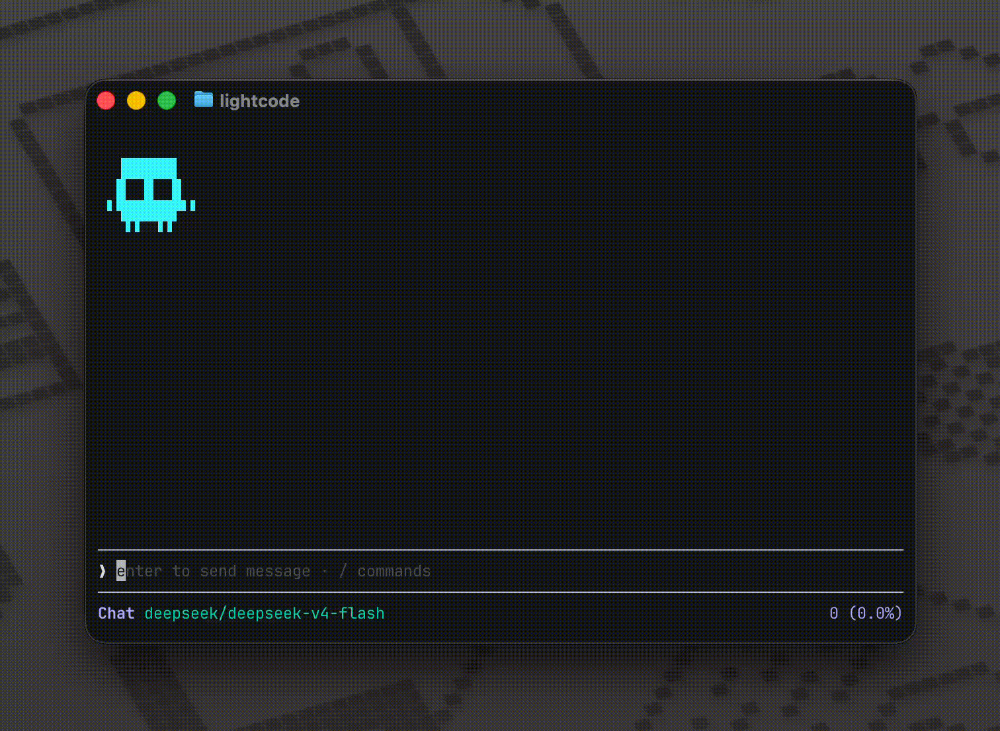

# Lightcode

Lightcode is a light weight **coding agent** written in Go.



## Requirements

- [Go](https://go.dev/dl/) **1.25+**
- At least one OpenAI-compatible endpoint configured (see **Models** below)

## Install

Run `go install github.com/Kartik-2239/lightcode/cmd/lightcode@latest`

## Configuration

Settings live under **`~/.lightcode/`**. The app creates this directory and a default **`config.json`** on first run.

### Models

Providers must speak the **OpenAI Chat Completions** API. Add entries to the `models` array in `~/.lightcode/config.json`. Each entry is an object with:

Example:

```json
{
  "theme": "light",
  "skills_path": "choose_any_skill_path"
  "port: "8000"
  "providers": [
    {
      "models": ["another-model-id"],
      "base_url": "https://your-gateway.example/v1",
      "api_key": "..."
    },
    {
      "models": ["another-model-id-2]",
      "base_url": "https://your-gateway.example/v1",
      "api_key": "..."
    }
  ]
```

- In the TUI, run **`/models`** to select one of the models after adding the models in config.json.

### Skills (greatly improves performance)

Put skills in **`~/.lightcode/skills/`**, each in its own subdirectory containing a **`SKILL.md`** file.

### Server Port

The HTTP API defaults to port **8080**. To use a different port, Set `port` in  `~/.lightcode/config.json`.

```bash
go run ./cmd/lightcode/main.go
```

## Quick start

Run the **API server** (by default listens on **`:8080`**) and **TUI**:

```bash
go run ./cmd/lightcode/main.go
```


## Todo

- [x] copy paste multiple lines into a [ paste #1 13 lines ]
- [x] better tool and thinking formating
- [x] Skills
- [x] grep tool
- [x] first make the ui work
- [x] UI upgrades
- [x] Make config files
- [X] improve tools and make test
- [x] Fix the database bug
- [x] Limit accessible directory to working dir
- [x] question tool - homepage 381, just need to create a ui and send chat completion request
- [x] Show Code changes
- [x] Plan mode - prompt and tool filter
- [x] todo tool - handle in the ui and send it as context in agent.go 
- [x] json data for model selection etc
- [x] need to also integrate anthropic go sdk cause response format for tool calling in models like
 glm and claude (fixed without adding anthropic api)
- [x] Add a nicer way to use multiple agents like plan, build etc.

- [x] Check for credentials before making an api call in .env
- [x] queue
- [x] handle basic errors

- [x] break the ui into more manageable parts
- [x] handle space under dot
- [x] AGENTS.md
- [x] /usage command
- [x] add flags like -p for prompting and -id and all for session id and run the cli that way

- [x] prevent random stopping of agent loop
- [x] add context compaction
- [x] fix same message twice bug

- [ ] manage context better and improve quality

- [ ] add model selections, from the ui, like add models with api keys
- [ ] File tracker


